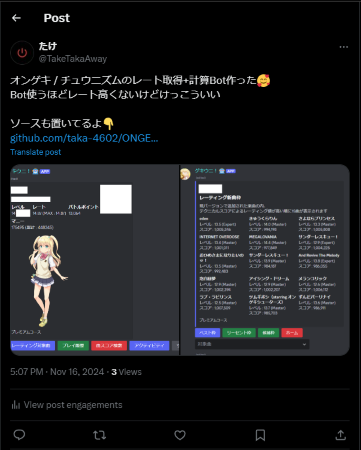

# ONGEKI.Net-CHUNITHM.Net-Scraper 
オンゲキ NET と チュウニズム NETから情報を取得するAPIラッパー、マイマイの予定はありません  
## インストール  
音擊  
```
pip install ongeki-scraper
```  
チュウニズム  
```
pip install chunithm-scraper
```
必須 : requests, bs4  
## セッションは1つまでしか作れません
他のブラウザーウィンドウなどでログインすると、今までのセッションは破棄されます  
## セッションは短命です
ユーザーIDとPHPセッションIDはすぐ死んでしまいます
## Webでできることしかできません 
あたりまえですが、無料アカウントでプレミアムアカウントの機能使ったりは無理です  
というかそもそもjson受け取れるようなAPIはなかったので100% Webスクレイピングです 
## まずは音撃から  
#### example_ongeki.py
```py
from ongeki_screper import ONGEKI

ongeki=ONGEKI("SEGA ID","パスワード")#SEGA IDとパスワードでログイン
print(ongeki.token,ongeki.user_id)#セッションの維持に必要なトークンとユーザーID !!ユーザーIDという名前なだけでランダムに変わるクッキーです!!
print(ongeki.name)#プレイヤー名
print(ongeki.plate)#プレートの文字
print(ongeki.rating,ongeki.raiting_max)#レート
print(ongeki.battle_point)#バトルポイント
print(ongeki.money,ongeki.money_total)#マニー
print(ongeki.leveling,ongeki.leveling_reincarnation)#レベルと転生回数
print(ongeki.icon)#アイコン画像
print(ongeki.character)#キャラクター画像
print(ongeki.course)#利用券
ongeki=ONGEKI(token=ongeki.token,user_id=ongeki.user_id)#トークンとユーザーIDでログインをスキップ
all_music=ongeki.get_all_music()#難易度別で全曲を取得
rating_music=ongeki.check_rating_music()#レーティング対象曲をすべて取得
print(rating_music.rating_new)#新曲枠
print(rating_music.rating_best)#ベスト枠
print(rating_music.rating_recent)#リーセント枠
print(rating_music.rating_candidate)#候補枠
check_rating_music=rating_music.rating_best[0]#ベスト枠はリストなので1番上を取得
score_detail=ongeki.music_score_details(check_rating_music["idx"])#idxが曲の詳細を取得するためのトークンみたいなもの
print(playlog_score_detail)
print(score_detail.music_title)#タイトル
print(score_detail.music_img)#ジャケットの画像
print(score_detail.music_artist)#アーティスト
print(score_detail.music_genre)#ジャンル
print(score_detail.music_enemy)#敵の情報
print(score_detail.MASTER_battle_score)#バトルスコア
print(score_detail.MASTER_technical_score)#テクニカルスコア
print(score_detail.MASTER_icon_technical_rank)#テクニカルランク
print(score_detail.MASTER_over_damage)#オーバダメージ
print(score_detail.MASTER_last_played)#最終プレイ日
history=ongeki.get_history()#プレイ履歴を取得
last_played=history[0]#プレイ履歴の1番上
playlog_score_detail=ongeki.playlog_score_details(last_played["idx"])#idxを使ってプレイ履歴の詳細を取得
print(playlog_score_detail)
print(playlog_score_detail.music_title)#タイトル
print(playlog_score_detail.music_img)#ジャケット画像
print(playlog_score_detail.music_difficulty)#難易度
print(playlog_score_detail.music_played)#プレイ日時
print(playlog_score_detail.music_battle_score)#バトルスコア
print(playlog_score_detail.music_technical_score)#テクニカルスコア
print(playlog_score_detail.music_over_damage)#オーバーダメージ
print(playlog_score_detail.max_combo)#コンボ数
print(playlog_score_detail.critical_break)#クリティカルブレイク
print(playlog_score_detail.ongeki_break)#ブレイク
print(playlog_score_detail.hit)#ヒット
print(playlog_score_detail.miss)#ミス
print(playlog_score_detail.damage)#ダメージ
print(playlog_score_detail.tap)#タップ
print(playlog_score_detail.hold)#ホールド
print(playlog_score_detail.side_tap)#サイドタップ
print(playlog_score_detail.side_hold)#サイドホールド
```  
#コメントに書いてある通り...  
### それ以外の返り値
##### レーティング対象曲 / プレイ履歴  
```
{'title': 'きゅうくらりん', 'level': '14', 'difficulty': 'Master', 'technical_score': '994,198', 'technical_score_int': 994198, 'idx': 'tD6VKJAiSJqbOH2pSJJjTON434ODt50u7C9krAwAFPPhowOm3tEW0atNrTgLAIWzQ7YaMdJxKOGOxp3urrR%2BtA%3D%3D'}
```
dictの中に簡易的な説明が入ってるので単にテクニカルスコアだけ知りたい場合、スコアの詳細を取得しなくてもだいじょうぶ  
##### 全曲
プレイ済み
```
'Cutter':{'idx': 'hEr/DTD/cn70Wlvr%2BQXFdJoAZQxOqZI6ohty6tyx8O4AhuqhZKYBKf5H8/prgd3Zh72wyfQG6oVFQqNuErzKcA%3D%3D', 'battle_score': '302.01%', 'over_damage': '9,752,464', 'technical_score': '1,003,145'}
```  
未プレイ  
```
'Recollect Lines':{'idx': 'G4LE%2BayGWh88q9ziJBDOyQuZRl088qgKmAFN0hAWbd5C/UEBmGISVIASZyJJpCqSovY7EODj6EjGbMUeal/zTw%3D%3D', 'battle_score': None, 'over_damage': None, 'technical_score': None}
```
dict in dictになっているため、```all_music["曲名"]``` でidxやスコアを確認できる  
#### スコア詳細
```
SCORE_DETAILS(MASTER_level='13+', MASTER_last_played='2024/11/11 20:28', MASTER_play_count='31', MASTER_over_damage='298.52%', MASTER_battle_score='9,730,844', MASTER_technical_score='998,888', MASTER_icon_battle_rank='https://ongeki-net.com/ongeki-mobile/img/music_icon_br_great.png?ver=1.45.0', MASTER_icon_technical_rank='https://ongeki-net.com/ongeki-mobile/img/music_icon_tr_ss.png?ver=1.45.0', MASTER_icon_bell='https://ongeki-net.com/ongeki-mobile/img/music_icon_fb.png', MASTER_icon_combo='https://ongeki-net.com/ongeki-mobile/img/music_icon_back.png', EXPERT_level='12', EXPERT_last_played='2024/09/26 19:03', EXPERT_play_count='17', EXPERT_over_damage='303.69%', EXPERT_battle_score='9,396,988', EXPERT_technical_score='1,007,995', EXPERT_icon_battle_rank='https://ongeki-net.com/ongeki-mobile/img/music_icon_br_excellent.png?ver=1.45.0', EXPERT_icon_technical_rank='https://ongeki-net.com/ongeki-mobile/img/music_icon_tr_sssplus.png?ver=1.45.0', EXPERT_icon_bell='https://ongeki-net.com/ongeki-mobile/img/music_icon_fb.png', EXPERT_icon_combo='https://ongeki-net.com/ongeki-mobile/img/music_icon_fc.png?ver=1.45.0', LUNATIC_level=None, LUNATIC_last_played=None, LUNATIC_play_count=None, LUNATIC_over_damage=None, LUNATIC_battle_score=None, LUNATIC_technical_score=None, LUNATIC_icon_battle_rank=None, LUNATIC_icon_technical_rank=None, LUNATIC_icon_bell=None, LUNATIC_icon_combo=None, music_img='https://ongeki-net.com/ongeki-mobile/img/music/c159c9bee6a1fb73.png', music_title='Cyaegha', music_genre='VARIETY', music_artist='USAO「Arcaea」', music_enemy='光 Lv.35')
```  
レベル別になってるので長い、プレイしていないレベルは```None```
#### プレイ履歴のスコア詳細  
```
SCORE_DETAILS(played='2024/11/11 20:34', music_img='https://ongeki-net.com/ongeki-mobile/img/music/5ab5414aa44d6a03.png', music_title='Knight Rider', music_battle_score='9,282,581', music_over_damage='323.16％', music_technical_score='986,641', max_combo='731', critical_break='1,149', ongeki_break='128', hit='39', miss='4', bell='117/117', damage='4', music_difficulty='Master', tap='95%', hold='99%', flick='99%', side_tap='96%', side_hold='100%')
```
こっちはブレイク数やタップの詳細なども取得できる  

## チュウニズム  
音撃とだいたい同じ...  
#### example_chunithm.py  
```py
from chunithm_scraper import CHUNITHM

chunithm=CHUNITHM("SEGA ID","パスワード")#SEGA IDとパスワードでログイン
print(chunithm.token,chunithm.php_sess_id)#セッションの維持に必要なトークンとPHPセッションID
print(chunithm.name)#プレイヤー名
print(chunithm.plate)#プレートの文字
print(chunithm.rating,chunithm.raiting_max)#レート
print(chunithm.money,chunithm.money_total)#通貨
print(chunithm.leveling,chunithm.leveling_reincarnation)#レベルと転生回数
print(chunithm.icon)#アイコン画像
print(chunithm.course)#利用券
chunithm=CHUNITHM(token=chunithm.token,php_sess_id=chunithm.php_sess_id)#トークンとPHPセッションIDでログインをスキップ
all_music=chunithm.get_all_music()#難易度別で全曲を取得
rating_music=chunithm.check_rating_music("Best")#レーティング対象曲を取得、Bestでベスト枠、Recentでリーセント枠、Nextで候補枠
print(rating_music)#ベスト枠
check_rating_music=rating_music[0]#ベスト枠の1番上を取得
rating_music=chunithm.check_rating_music("Recent")
print(rating_music)#リーセント枠
rating_music=chunithm.check_rating_music("Next")
print(rating_music)#候補枠
score_detail=chunithm.music_score_details(check_rating_music["idx"],check_rating_music["token"])#チュウニズムの曲詳細を取得するには、idxとtokenも必要になる
print(score_detail)
print(score_detail.music_title)#タイトル
print(score_detail.music_img)#ジャケットの画像
print(score_detail.music_artist)#アーティスト
print(score_detail.MASTER_score)#スコア
print(score_detail.MASTER_icon_rank)#ランクの画像
print(score_detail.MASTER_icon_clear)#クリアの画像
print(score_detail.MASTER_icon_combo)#フルコンボとかの画像
history=chunithm.get_history()#プレイ履歴を取得
last_played=history[0]#プレイ履歴の1番上
playlog_score_detail=chunithm.playlog_score_details(last_played["idx"],last_played["token"])#idxとトークンを使ってプレイ履歴の詳細を取得
print(playlog_score_detail)
print(playlog_score_detail.character)#キャラクター
print(playlog_score_detail.skill)#スキル
print(playlog_score_detail.music_img)#ジャケット画像
print(playlog_score_detail.music_difficulty)#難易度
print(playlog_score_detail.music_score)#スコア
print(playlog_score_detail.music_played)#プレイ日時
print(playlog_score_detail.max_combo)#コンボ数
print(playlog_score_detail.justice_critical)#ジャスティスクリティカル
print(playlog_score_detail.justice)#ジャスティス
print(playlog_score_detail.attack)#アタック
print(playlog_score_detail.miss)#ミス
print(playlog_score_detail.tap)#タップ
print(playlog_score_detail.hold)#ホールド
print(playlog_score_detail.slide)#スライド
print(playlog_score_detail.air)#エアー
print(playlog_score_detail.flick)#フリック
```  
これも#コメントで書いてある通り...  
### それ以外の返り値
##### レーティング対象曲 / プレイ履歴  
```
{'title': 'MEGALOVANIA', 'difficulty': 'Expert', 'score': '985,342', 'score_int': 985342, 'diff': '2', 'genre': '99', 'idx': '2137', 'token': 'fad775feb5e372ffa4b3d6c584422e3a'}
```
dictの中に簡易的な説明が入ってるので単にテクニカルスコアだけ知りたい場合、スコアの詳細を取得しなくてもだいじょうぶ  
##### 全曲
プレイ済み
```
'レーイレーイ':{'diff': '3', 'genre': '99', 'idx': '829', 'token': '86a3e43df22bd6b63fdd97b3a5db0f47', 'score': '918,394'}
```  
未プレイ  
```
'Radiance':{'diff': '3', 'genre': '99', 'idx': '2111', 'token': 'bfa9c3e9f184e546f542df469dfbb059', 'score': None}
```
dict in dictになっているため、```all_music["曲名"]``` でidxとtokenやスコアを確認できる  
#### スコア詳細
```
SCORE_DETAILS(MASTER_play_count=None, MASTER_score=None, MASTER_icon_rank=None, MASTER_icon_combo=None, MASTER_icon_clear=None, EXPERT_play_count='1回', EXPERT_score='985,342', EXPERT_icon_rank='https://new.chunithm-net.com/chuni-mobile/html/mobile/images/icon_rank_8.png', EXPERT_icon_combo='https://new.chunithm-net.com/chuni-mobile/html/mobile/images/icon_rank_8.png', EXPERT_icon_clear='https://new.chunithm-net.com/chuni-mobile/html/mobile/images/icon_clear.png', ULTIMA_play_count=None, ULTIMA_score=None, ULTIMA_icon_rank=None, ULTIMA_icon_combo=None, ULTIMA_icon_clear=None, music_img='https://new.chunithm-net.com/chuni-mobile/html/mobile/img/f7b116709baab037.jpg', music_title='MEGALOVANIA', music_artist='Toby Fox「UNDERTALE」')
```  
レベル別になってるので長い、プレイしていないレベルは```None```
#### プレイ履歴のスコア詳細  
```
SCORE_DETAILS(music_played='2024/11/11 20:46', music_img='https://new.chunithm-net.com/chuni-mobile/html/mobile/img/94e81ba6b24960b8.jpg', music_title='8OROCHI', music_score='990,754', music_difficulty='Expert', character='藤沢 柚子／デイドリーム・フェアリーズ', skill='オールガード【LMN】', max_combo='567', justice_critical='1,302', justice='122', attack='15', miss='19', tap='97.43%', hold='100.97%', slide='100.34%', air='100.84%', flick='0.00%', icon_clear='https://new.chunithm-net.com/chuni-mobile/html/mobile/images/icon_clear.png', icon_rank='https://new.chunithm-net.com/chuni-mobile/html/mobile/images/icon_rank_9.png', icon_combo='https://new.chunithm-net.com/chuni-mobile/html/mobile/images/icon_rank_9.png')
```
こっちは使用キャラクター、スキル、ジャスティスやエアーの詳細なども取得できる  
### もう少し知る
#### 音撃とチュウニズムでは取得できる情報にバラつきがある  
えーこれオンゲキ.netだと表示できるのにチュウニズム.netじゃ見れないのかーって項目はもちろんこのスクレイパーでも取得できないし、逆も当然そう  
#### idxやtokenは取得するごとに変わる
データベースに保存して再利用はできません
#### 忘れがちだけどメンテナンスの時は使えません
音撃は 4:00～7:00  
チュウニズムは 2:00～7:00  
### 余談  
Discordで使えるオンゲキ / チュウニズムのレート確認Bot作ったけど、かなりいい感じ  
https://x.com/TakeTakaAway/status/1857697088374714646  
  
ただ100% WebスクレイピングなのでできることはWebとはまったく変わらないのが少し悲しい  
基本的にCLIで情報を確認するときなんかない (´；ω；`)  
せっかく情報が取得できるならレート計算機でもつけた方がいいかなと思ったり  
```py
def ongeki_rating(level:float, score:int):
    if score >= 1007500:
        return level + 2
    elif score >= 1000000:
        return round(level + 1.5 + (score - 1000000) / 15000, 2)
    elif score >= 990000:
        return round(level + 1 + (score - 990000) / 20000, 2)
    elif score >= 970000:
        return round(level + (score - 970000) / 20000, 2)
    else: #AAA以下の場合
        return round(level + (score - 970000) / 17500 ,2)
```
```py
def chunithm_rating(level:float, score:int):
    if score >= 1009000:
        return level + 2.15
    elif score >= 1007500:
        return round(level + 2.0 + (score - 1007500) // 100 * 0.0 ,2)
    elif score >= 1005000:
        return round(level + 1.5 + (score - 1005000) // 50 * 0.01 ,2)
    elif score >= 1000000:
        return round(level + 1.0 + (score - 1000000) // 100 * 0.01 ,2)
    elif score >= 990000:
        return round(level + 0.6 + (score - 990000) // 250 * 0.01 ,2)
    elif score >= 975000:
        return round(level + (score - 975000) // 250 * 0.01 ,2)
    elif score >= 950000: #AAA以下の場合
        return round(level - 1.5 ,2)
    elif score >= 925000:
        return round(level - 3.0 ,2)
    elif score >= 900000:
        return round(level - 5.0 ,2)
    elif score >= 800000:
        return round((level - 5.0) / 2 ,2)
    else:
        return 0
```  
レート計算の式はこんな感じ、曲レートがわかると到達可能レートも計算できるみたいなので  
```py
rate_all=[]
for best in rating_all.rating_best:
    rate_all.append(ongeki_rating(float(譜面定数),best["technical_score_int"]))
        
average = sum(rate_all) / len(rate_all)
reachable = round(average*0.75 + rate_all[0]*0.25, 2)
```  
これで到達可能レートが計算できるらしい、ただレベルはもちろん譜面定数が必要だけど。  
譜面定数はまた他のサイトをスクレイピングしてデータベースに保存して、そこから参照するしかない...  
## コンタクト  
Discord サーバー / https://discord.gg/aSyaAK7Ktm  
Discord ユーザー名 / .taka.   
